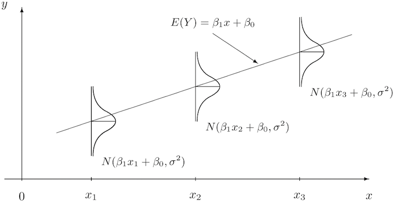

```{r setup, include=FALSE}
mpg <- read.csv(file = "https://github.com/math430-lu/data/raw/master/mpg.csv", as.is = TRUE)
library(ggplot2)
```

## Overview: Fuel Economy Data

- Many factors go into determining what gas mileage a car will achieve
- For now, we will focus on the **weight** of a car
- It's generally understood that heavier cars will get worse fuel economy, but it is not clear how much of an increase in weight will lead to a decrease in fuel economy

## Overview: Fuel Economy Data {.columns-2}
```{r}
head(mpg)
```
```{r}
dim(mpg)
```

<br>

Notation:

$y_i =$ MPG for $i^{\text{th}}$ car

$x_i =$ weight of $i^{\text{th}}$ car

$i = 1, \ldots, n$

$n =$ sample size


# Exploratory Data Analysis (EDA)

## EDA: Scatterplots

```{r, eval=FALSE}
qplot(x = Weight, y = MPG, data = mpg)
```

<div class="columns-2">
```{r, echo=FALSE}
qplot(x = Weight, y = MPG, data = mpg)
```


Key aspects of a scatterplot:

* Form
* Direction
* Strength
* Outliers / unusual features
</div>

## EDA: Correlation
### Formula:

$$Corr(X, Y) = r = \dfrac{1}{n-1} \sum_{i = 1}^n \left( \dfrac{x_i - \overline{x}}{s_x} \right) \left( \dfrac{y_i - \overline{y}}{s_y} \right)$$

### Properties:
  1. $-1 \le r \le 1$
  2. scale invariant

### R code:
```{r}
cor(mpg$Weight, mpg$MPG)
```

## Caution  {.columns-2}

Correlation only measures the strength/direction of **linear relationships**

```{r}
x <- -5:5
y <- x^2
cor(x, y)
```

```{r, echo=FALSE}
qplot(x, y) + geom_smooth(method = "lm", se = FALSE)
```


## Caution

Correlation is **sensitive to outliers**

```{r, echo=FALSE, message=FALSE, fig.width=8 , fig.height=4, out.width="800px", out.height="400px"}
library(gridExtra)
p1 <- qplot(x3, y3, data = anscombe) +
  xlab("x") + ylab("y") + scale_y_continuous(limits=c(5,13)) +
  annotate("text", label = "r = 0.816", x = 6, y = 12, size = 6)

p2 <- qplot(x3, y3, data = subset(anscombe, y3 < 9)) +
  xlab("x") + ylab("y") + scale_y_continuous(limits=c(5,13)) +
  annotate("text", label = "r = 0.999", x = 6, y = 12, size = 6)

grid.arrange(p1, p2, nrow = 1)
```


## Model selection

<div class="columns-2">
```{r, echo=FALSE}
qplot(x = Weight, y = MPG, data = mpg)
```

<br>
<br>
<br>

$y_i = f(x_i) + \varepsilon_i$

What is a good model for the fuel economy data?
</div>

# Simple Linear Regression (SLR)

## Simple Linear Regression Model

$y_i = \beta_0 + \beta_1 x_i + \varepsilon_i$

$\varepsilon_i \overset{\text{iid}}{\sim} \mathcal{N}(0, \sigma_\varepsilon)$

which is equivalent to

$y_i \overset{\text{iid}}{\sim} \mathcal{N}(\beta_0 + \beta_1 x_i, \sigma_\varepsilon)$

## Simple Linear Regression Model



## Simple Linear Regression Model


### Interpretations

</br>

$\beta_0$

</br>
</br>

$\beta_1$

</br>
</br>

$\sigma_\varepsilon$


## Simple Linear Regression Model

### Assumptions

1. Linearity
2. Zero mean
3. Constant error variance
4. Independence
5. Random
6. Normality of error terms

## Fitting the SLR Model

### **Model**
$y_i \overset{\text{iid}}{\sim} \mathcal{N}(\beta_0 + \beta_1 x_i, \sigma_\varepsilon)$

### **Problem**
We need values for $\beta_0$, $\beta_1$, and $\sigma_\varepsilon$!!

### **Solution**
- Least squares estimation
- Maximum likelihood estimation (details in Math 445)
- Bayesian estimation (take Math 445)


## Least Squares Estimation

### **Target**

The "best" estimates of $\beta_0$ and $\beta_1$

### **Procedure**

Find the $\widehat{\beta}_0$ and $\widehat{\beta}_1$ that minimizes 

$$\sum_{i=1}^n \left(y_i - \widehat{\beta}_0 - \widehat{\beta}_1 x_i \right)^2$$

## Least Squares Estimation

### Intuition
```{r, echo=FALSE}
mod <- lm(MPG ~ Weight, data = mpg)
fit <- fitted(mod)

ls.df <- data.frame(y.hat = as.numeric(fit), y = mpg$MPG, x = mpg$Weight)
ls.df$ymin <- as.numeric(apply(ls.df, 1, FUN = function(x) min(x["y.hat"], x["y"])))
ls.df$ymax <- as.numeric(apply(ls.df, 1, FUN = function(x) max(x["y.hat"], x["y"])))


ggplot(data = mpg, aes(x = Weight, y = MPG)) +  
    geom_linerange(aes(ymin = ymin, ymax = ymax, x = x), data = ls.df, inherit.aes = FALSE, colour = I("gray60")) +
  geom_point() + 
  geom_smooth(method = "lm", se = FALSE)
```


## Least Squares Estimation

### **Solution**

$$\begin{align}
\widehat{\beta}_0 &= \overline{y} - \widehat{\beta}_1 \overline{x}\\
\widehat{\beta}_1 &= \dfrac{\displaystyle \sum_{i=1}^n \left(y_i - \overline{y} \right) \left(x_i - \overline{x} \right)}{\displaystyle \sum_{i=1}^n \left(x_i - \overline{x} \right)^2}\\
  &= r \dfrac{s_y}{s_x}
\end{align}$$

**Note**: We do not get an estimate of $\sigma_\varepsilon$ using least squares.


## Regression (Residual) Standard Error

To obtain an estimate of $\sigma_\varepsilon$, we use the sum of the squared errors

$$\widehat{\sigma}_\varepsilon = \sqrt{\displaystyle \dfrac{\sum_{i=1}^n (y_i - \widehat{y}_i)^2}{n - 2}} = \sqrt{\dfrac{\text{SSE}}{n-2}}$$

## Properties of the Estimators

- $\widehat{\beta}_0$ and $\widehat{\beta}_1$ are **unbiased estimates** of $\beta_0$ and $\beta_1$
<br>
<br>
<br>
- $\widehat{\beta}_0$ and $\widehat{\beta}_1$ are the *best linear unbiased estimates* (BLUE); that is, they have the smallest variance of all linear unbiased estimates
<br>
<br>
<br>
- $\widehat{\sigma}_\varepsilon$ is an unbiased estimate of $\sigma_\varepsilon$

## Fitting SLR Models in R {.smaller}


```{r}
mod <- lm(MPG ~ Weight, data = mpg)
summary(mod)
```

## Using the Model for Prediction

How would we use the model to predict the MPG for a car weighing 2,500 lbs?

<br>
<br>
<br>

How do we interpret this number?


## Using the Model for Prediction

How would we use the model to predict the MPG for a semi weighing 20,000 lbs? 
Does this prediction make sense?


## Prediction in R


```{r}
mod <- lm(MPG ~ Weight, data = mpg)
predict(mod, newdata = data.frame(Weight = 2500))
predict(mod, newdata = data.frame(Weight = 20000))
```